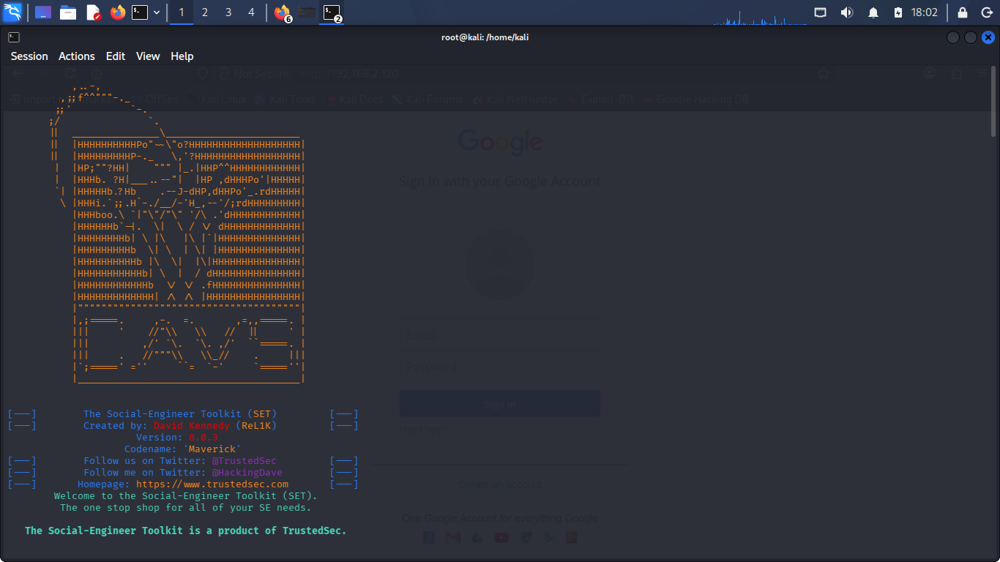
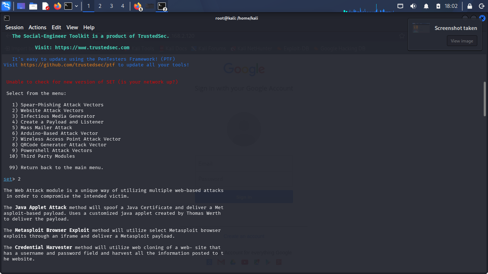
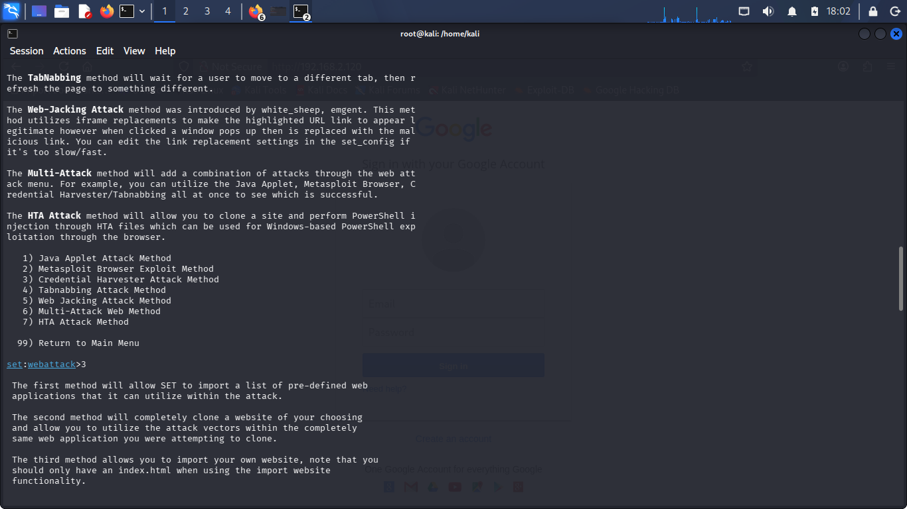
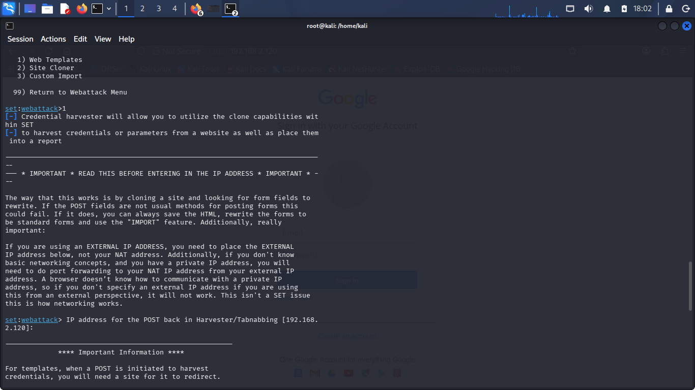
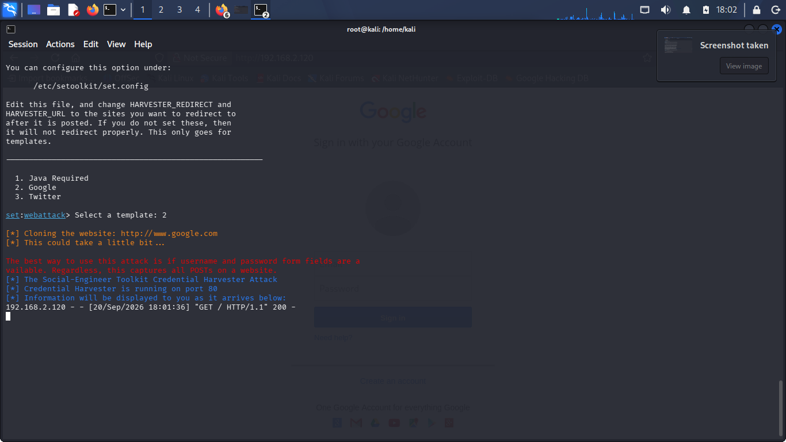
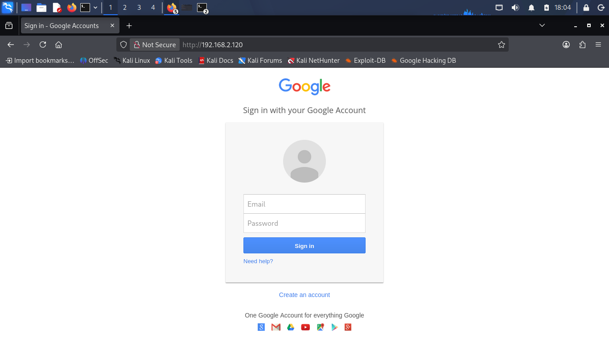

# phishing-lab-set
# 🛡️ Laboratório Prático: Credential Harvesting com Social-Engineer Toolkit (SET)

## 📌 Descrição do Projeto
Este repositório documenta a execução de um laboratório prático de Engenharia Social focado na técnica de **Credential Harvesting** (captura de credenciais) utilizando a ferramenta **Social-Engineer Toolkit (SET)** em ambiente virtualizado controlado (Kali Linux).

O objetivo do exercício é demonstrar o funcionamento técnico de ataques de Phishing baseados em formulários web, analisando a mecânica de redirecionamento HTTP/POST e a importância de mecanismos de defesa como HTTPS estrito, HSTS e Autenticação Multifator (MFA).

> ⚠️ **Aviso de Isenção de Responsabilidade:** Este projeto foi executado estritamente para fins acadêmicos e educacionais em uma rede local privada (RFC 1918) isolada.

---

## 🧰 Ferramentas e Ambiente
* **Sistema Operacional:** Kali Linux (VM em modo Network Bridge)
* **Ferramenta Principal:** Social-Engineer Toolkit (`setoolkit`)
* **Endereço IP do Atacante (Local):** `192.168.2.120` (Porta HTTP 80)
* **Aplicação Alvo:** Web Template Interno (Google Login Page)

---

## ⚙️ Passo a Passo da Execução

### 1. Inicialização do SET
Início da ferramenta com privilégios de superusuário no terminal do Kali Linux:
```bash
sudo setoolkit
```
## 📸 Evidências do Laboratório

### Etapa 1: Inicialização do SET e Banner


### Etapa 2: Seleção do Módulo de Ataque Web


### Etapa 3: Seleção do Método Credential Harvester e Web Templates


### Etapa 4: Escolha do Template do Google e Inicialização da Porta 80


### Etapa 5: Execução do Servidor Web do SET


### Etapa 6: Acesso à Página Cloned do Google no Navegador

